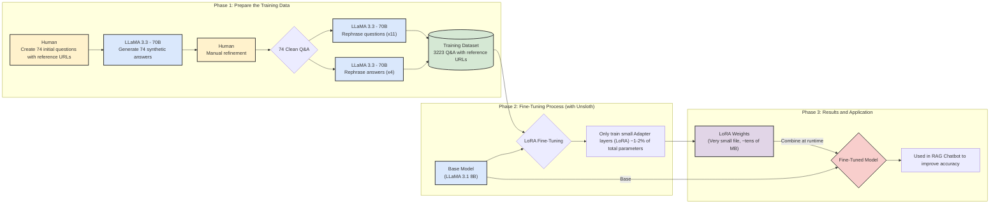

# LoRA for RAG
**Domain Focus:** Legal Assistant (Law) & Internal IT Support (ITS).

**Key Approach:** Privacy-first on-premises AI combining RAG and LoRA fine-tuning for Llama-3, completely avoiding external APIs.



This project investigates the use of Retrieval-Augmented Generation (RAG) and LoRA-based fine-tuning to build efficient and secure internal chatbots using small open-weight language models. The goal is to minimise computational costs while avoiding reliance on external APIs like OpenAI, ensuring greater control over data privacy.

Our first use case focuses on developing a legal assistant trained on the public laws of Wallis. We fine-tuned LLaMA 3.1 8B using synthetic question-answer pairs. While LoRA allowed efficient model adaptation, it did not yield significant performance improvements, and evaluation remained challenging due to subjective criteria and inconsistent automated metrics.

A second use case, involving internal IT documentation, showed more promising results. Through careful dataset curation and the introduction of a custom metric to reduce hallucinations, the model became more reliable. Fine-tuning improved precision but occasionally reduced recall, highlighting the trade-offs involved.

This work underscores both the potential and limitations of small open-weight LLMs for domain-specific applications. Future directions include integrating user feedback, formal benchmarking, and extending the architecture to multi-agent LLM systems for more complex tasks.

## CIT case

See [CIT README](./src/CIT/README.md) in the corresponding folder

## Wallis case
See [Wallis README](./src/Wallis/README.md) in the correponding folder


## Project structure

<pre>
src
├── CIT
│   ├── documents #not committed, can be generated using the scraping script
│   ├── evaluation
│   │   ├── compute_retrieval_metrics.py #scores the retrieval component
│   │   ├── compute_url_precision_recall.py #scores the RAG using the designed URL metric
│   │   ├── QA_generation
│   │   │   ├── answer_questions.py
│   │   │   ├── match_questions_answers.py
│   │   │   ├── rephrase_answers.py
│   │   │   ├── rephrase_questions.py
│   │   ├── scripts #shel script to launch above functions
│   │   │   ├── answers_rephrasing.sh
│   │   │   ├── launch_answers_generation.sh
│   │   │   ├── launch_url_stats_base.sh
│   │   │   ├── launch_url_stats_ft.sh
│   │   │   ├── match_questions_answers.sh
│   │   │   └── questions_rephrasing.sh
│   │   ├── utils.py 
│   │   └── viz
│   │       ├── explore_data.ipynb #stats about data length distribution
│   │       └── recall@k.ipynb #viz for retrieval recall
│   ├── RAGs
│   │   └── RAG_CIT.py #RAG to launch
│   ├── scraping
│   │   ├── config.py
│   │   ├── main.py #file to launch to scrape, you can define the arguments in settings.toml
│   │   ├── secrets.toml #not pushed, your tokens and settings to access Confluence
│   │   └── settings.toml
│   └── training
│       ├── preprocessing
│       │   ├── add_question_and_answers_id.py
│       │   ├── add_synthetic_retrieved_context.py
│       │   ├── check_data.ipynb
│       │   └── train_test_split.py
│       ├── scripts
│       │   ├── llama8b.sh
│       │   └── useless.sh
│       └── training_script.py
└── Wallis
    ├── evaluation
    │   ├── eval_RAG_QA.py #eval the RAG by a judge LLM
    │   ├── filter_non_retrieved_questions.py
    │   ├── notebooks
    │   │   └── viz #notebooks to vizualize results
    │   ├── QA_creation.py #generate QA
    │   └── QA_utils.py
    ├── RAGs
    │   ├── RAGv3.py #to launch RAG, hyperparameters to set
    │   └── VectorBase.pkl #the default vectorbase (used to launch the RAG quicker)
    ├── scraping.ipynb #notebook used to scrape the texts of laws
    ├── training
    │   ├── training_script.py
    │   └── train_test_split.py
</pre>


# How to use (focus on CIT CASE)
You can launch the scraping of the knowledge base by running the following command from the root folder
```bash
make scrape
``` 
It will write or overwrite the documents of the KB in ./src/CIT/documents/run2/confluence_json 

Then you can launch the RAG chatbot in a terminal (with the default arguments) with:
```bash
make run_rag
``` 
If you need to adapt the parameters (chunk size, chunk overlap, top_k, threshold, model, etc.), you can go to ./src/CIT/RAGs/launch_RAG.sh and set up the desired RAG.

If you want to launch the user interface:\
DEV (with hand on the RAG parameters and ongoing trials): The following command launches the streamlit app in ./src/CIT/UI/streamlit_app.py
```bash
make launch_ui_dev
``` 
PROD (no hands on parameters): launch the streamlit app in ./src/CIT/UI/streamlit_app_prod.py
```bash
make launch_ui_prod
``` 
